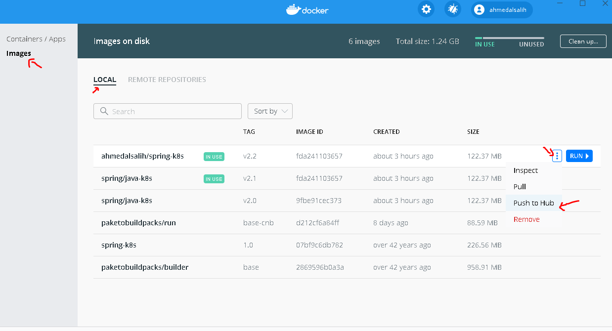
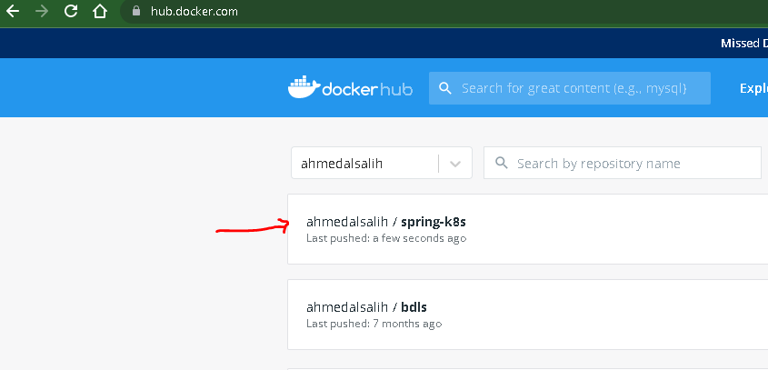
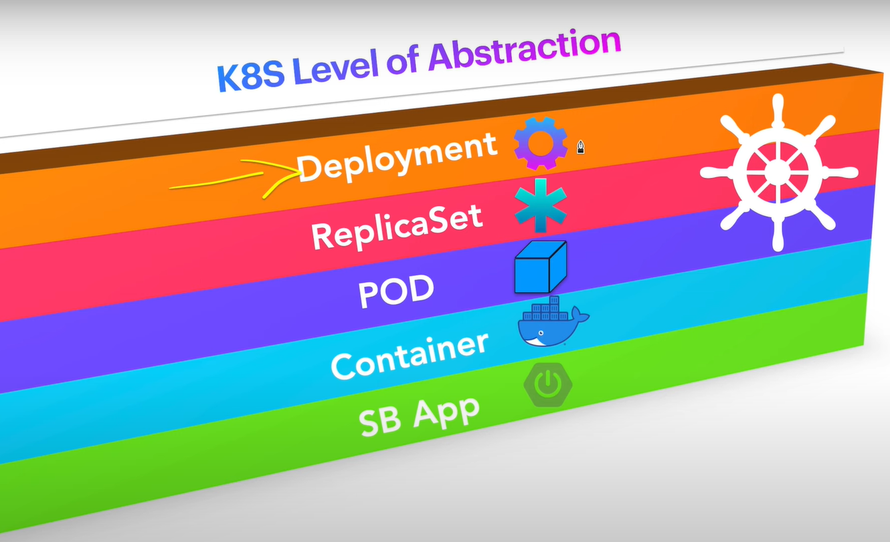

# spring-k8s-replicaset
SpringBoot to Kubernetes with ReplicaSet.


Kubernetes Master Components: Etcd, API Server, Controller Manager, and Scheduler

## Etcd [https://github.com/etcd-io/etcd]
etcd is a distributed reliable key-value store for the most critical data of a distributed system, with a focus on being:

- Simple: well-defined, user-facing API (gRPC)
- Secure: automatic TLS with optional client cert authentication
- Fast: benchmarked 10,000 writes/sec
- Reliable: properly distributed using Raft.
**Etcd** is written in Go and uses the Raft consensus algorithm to manage a highly-available replicated log. Raft is a consensus algorithm designed as an alternative to Paxos. The Consensus problem involves multiple servers agreeing on values; a common problem that arises in the context of replicated state machines. Raft defines three different roles (Leader, Follower, and Candidate) and achieves consensus via an elected leader. For further information, please read the (Raft paper)[https://raft.github.io/raft.pdf].

##**Etcdctl**[https://github.com/etcd-io/etcd/tree/main/etcdctl]
is the command-line interface tool written in Go that allows manipulating an etcd cluster. It can be used to perform a variety of actions, such as:

- Set, update and remove keys.
- Verify the cluster health.
- Add or remove etcd nodes.
- Generating database snapshots.
- You can play online with a 5-node etcd cluster at http://play.etcd.io.

## Scheduler
The Scheduler watches for unscheduled pods and binds them to nodes via the /binding pod subresource API, according to the availability of the requested resourcesThe Scheduler watches for unscheduled pods and binds them to nodes via the /binding pod subresource API, according to the availability of the requested resources. Once the pod has a node assigned, the regular behavior of the Kubelet is triggered and the pod and its containers are created.

## Controller Manager
The Kubernetes Controller Manager is a daemon that embeds the core control loops (also known as “controllers”) shipped with Kubernetes. Basically, a controller watches the state of the cluster through the API Server watch feature and, when it gets notified, it makes the necessary changes attempting to move the current state towards the desired state.

## API Server
When you interact with your Kubernetes cluster using the kubectl command-line interface, you are actually communicating with the master API Server component.


1. kubectl writes to the API Server.
1. API Server validates the request and persists it to etcd.
1. etcd notifies back the API Server.
1. API Server invokes the Scheduler.
1. Scheduler decides where to run the pod on and return that to the API Server.
1. API Server persists it to etcd.
1. etcd notifies back the API Server.
1. API Server invokes the Kubelet in the corresponding node.
1. Kubelet talks to the Docker daemon using the API over the Docker socket to create the container.
1. Kubelet updates the pod status to the API Server.
1. API Server persists the new state in etcd.

# Build the project

## Build a Docker Image 

1- Docker cmd build  `<Preferred>`
```
 docker build -t ahmedalsalih/spring-k8s:v2.2 .
```
or 

2-  Maven build
```
./mvnw spring-boot:build-image
```

## Run the image `FOR TEST ONLY`
```
docker run -p 9090:8080 ahmedalsalih/spring-k8s:v2.2
```

# Push the image to Docker Hub






# Run Kubernetes
run git bash `As Admin` the type:
```
minikube start
```


## Create deployment
```
kubectl create deployment springk8sapp --image=ahmedalsalih/spring-k8s:v2.2
```


`deployment and pod created as well.`




## kubectl

```
kubectl get pods
```

```
kubectl get replicaset
```

```
kubectl describe pod springk8sapp-64c6ff74cd-86hpv
```

`Success deployment creating`


# Dashboard
```
minikube dashboard
```

## Scale a resource / Replicaset
```
kubectl scale -n default deployment springk8sapp --replicas=3
```

## Update deployment
```
kubectl apply -f <spec.yaml>
```
# Create deployment from form


 
# Delete all deployment
```
kubectl delete --all deployments
```
**Checking** All three comends below should give `No resources found in default namespace.`

```
kubectl get pods
```
```
kubectl get deployment
```
```
kubectl get replicaset
```
# Create deployment `YAML` file
```
kubectl apply -f deployment.yaml
```


